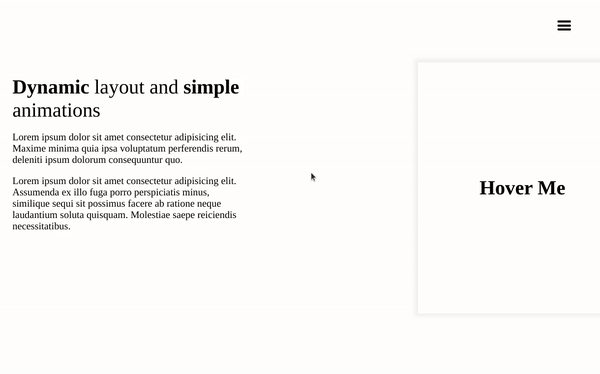

# Dynamic Menu 🧮

Simple page with dynamic layout using vanilla HTML, CSS, JS.

## Sources ⚓️

This project is a part of challenge problems from this article on [Medium](https://medium.com/better-programming/here-are-5-front-end-challenges-to-code-dec-2019-edition-7d691c4b023).

## Licence 🚨

Project is licensed under the [MIT](./LICENSE) public license
